## Azure Monitor Container Insights Walkthrough
This guide assumes that you have already configured an AKS on Azure Stack HCI. For instructions on how to deploy an AKS on Azure Stack HCI, please refer to the instructions [here](https://github.com/Azure/aks-hci/blob/main/eval/steps/1_AKSHCI_Azure.md).

### Configuring Container Insights
Once you have your cluster deployed, you can navigate to your Resource blade, as shown below
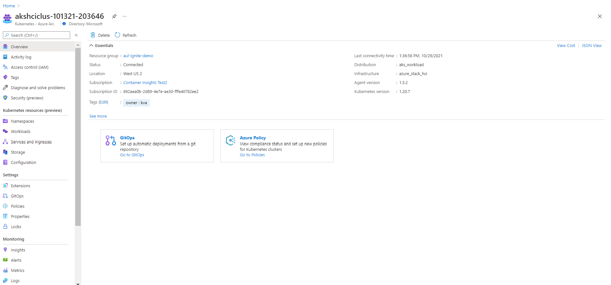

Then select the 'Insights' item from the left menu under the 'Monitoring' section
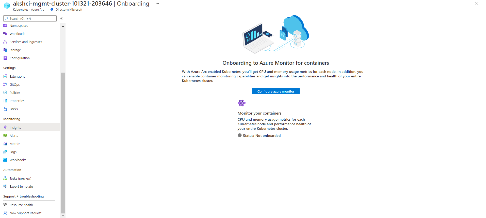

Select the 'Configure azure monitor' button to proceed with onboarding. For additional guidance or other onboarding options, please visit [our documentation](https://aka.ms/azcoinarc).

Once configured, you should start to see data flowing as below
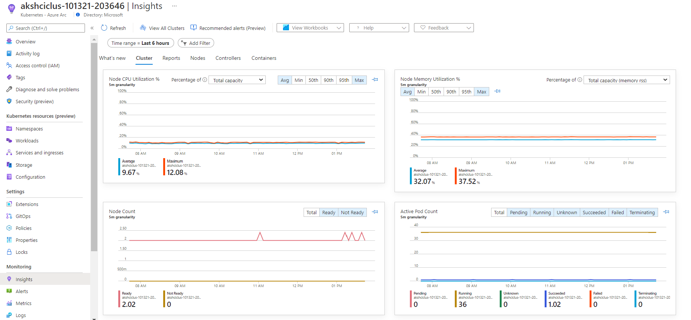

### Scenario 1: Drilling into Container Logs

Once you are on the 'Insights' blade, select the 'Containers' tab to switch to the Node view. This should provide you a list of all your Nodes and associated metrics.

You can select any of the containers you want to analyze or type in the search box for a specific container. For the demo, we looked at the 'hello-arc' application. Read more about how to [setup this application](https://azurearcjumpstart.io/azure_arc_jumpstart/azure_arc_k8s/day2/aks_stack_hci/aks_hci_gitops_basic/).

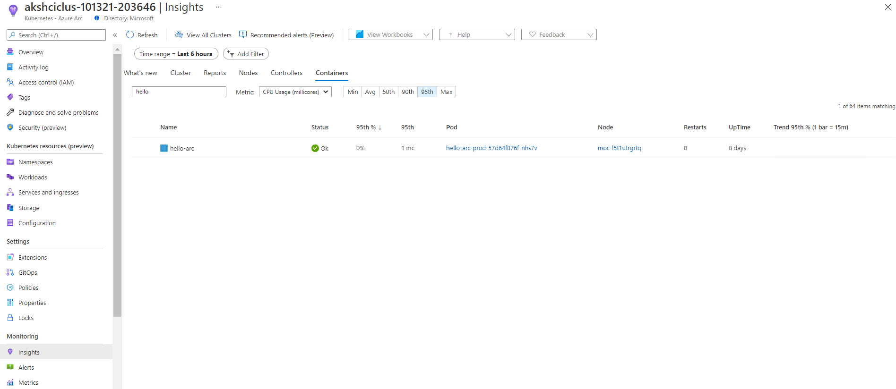

Selecting the container will open up a context blade with additional details.

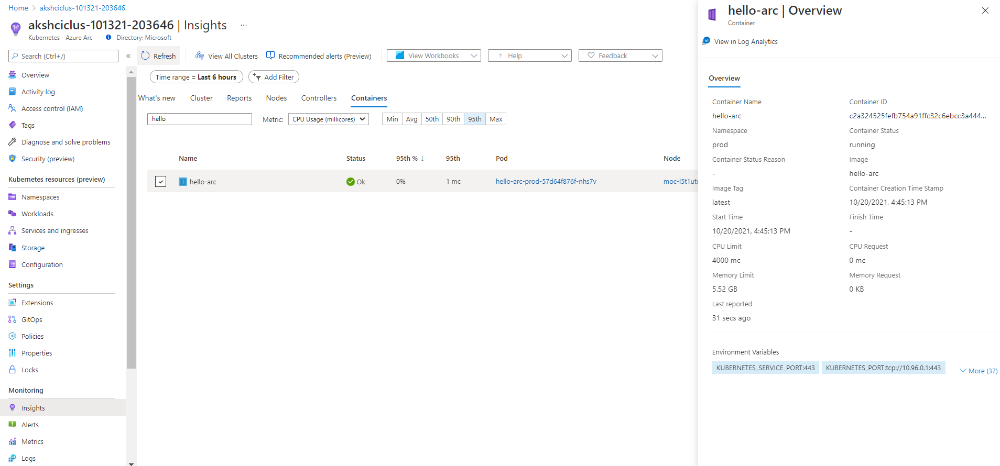

Click the 'View in Log Analytics' button at the top of the context blade. This will automatically generate a query to search for the container logs associated with this application.

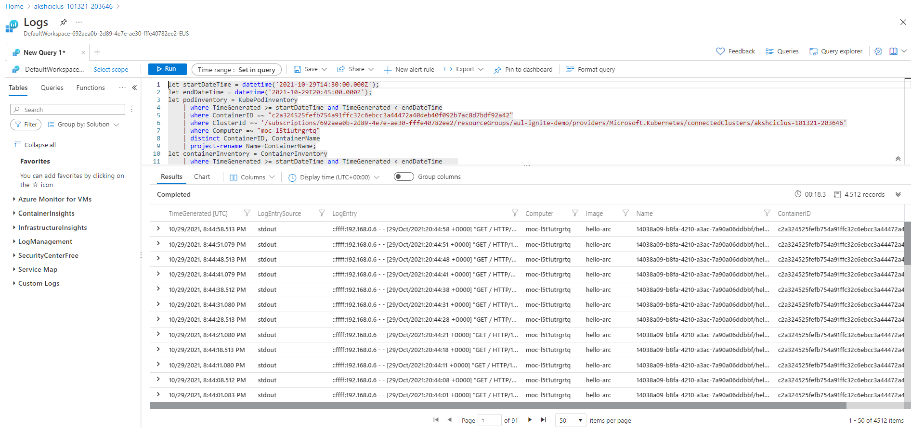

You can now search through the logs from the generated query or modify the query to scope down the search to help with any troubleshooting needs. To learn more about other logging scenarios, check out our [full documentation](https://docs.microsoft.com/azure/azure-monitor/containers/container-insights-log-query).

### Scenario 2: Configuring Recommended Alerts (Preview)

Configuring alerts can be tricky, so through the Container Insights Recommended alerts experience, we allow you to turn alerts on with a single click of the button.

In the 'Insights' blade, select the 'Recommended alerts (Preview)' button in the top navigation bar. This will open up a context blade with various alerting options.

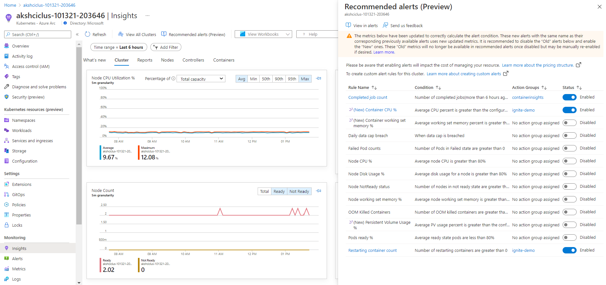

Toggling one of the buttons under the 'Status' column will turn on the alert. You should receive an Azure Portal notification indicating the alert is being created.

Once the alert is generated, it should show a 'No action group assigned' under the Action Groups column, as shown below:

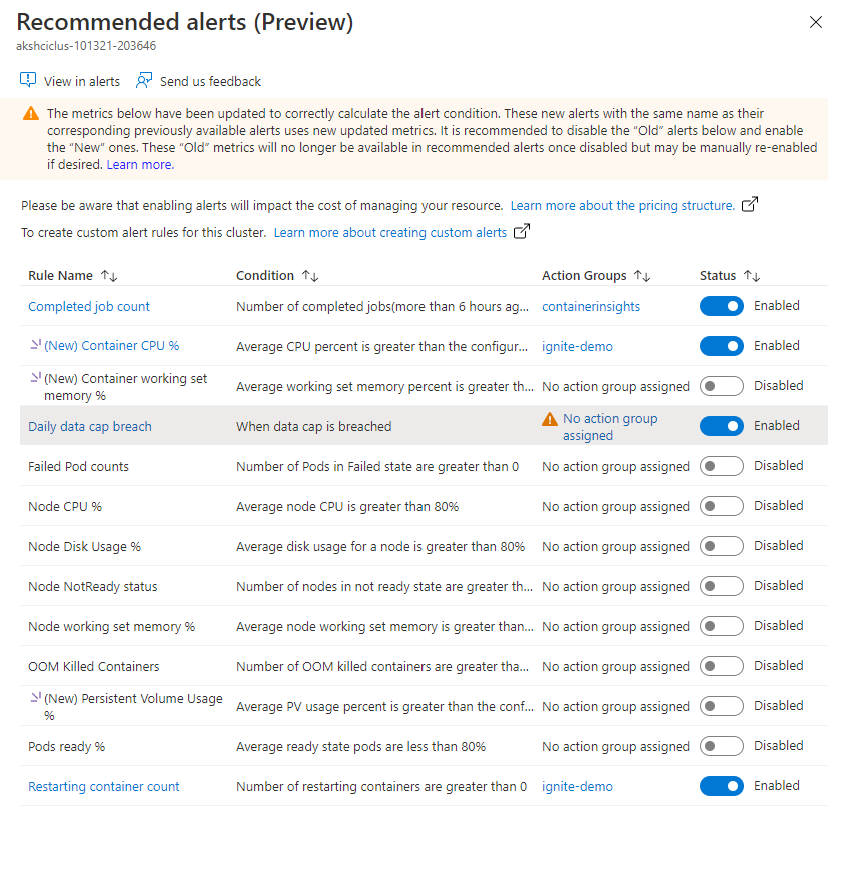

Selecting the 'No action group assigned' link, will lead to a new menu with a list of action groups inside your Susbcription.

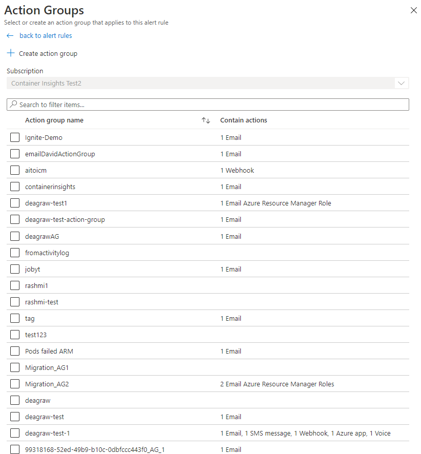

You can also create a new action group using the '+ Create action group' option at the top. Selecting one of these allows you to designate what kind of action or notification you receive when these alerts are triggered.

After selecting your action group(s), scroll to the bottom and select 'Apply to rule'. This will update the alert andyou should now see your alert successfully configured with the designated action group listed.

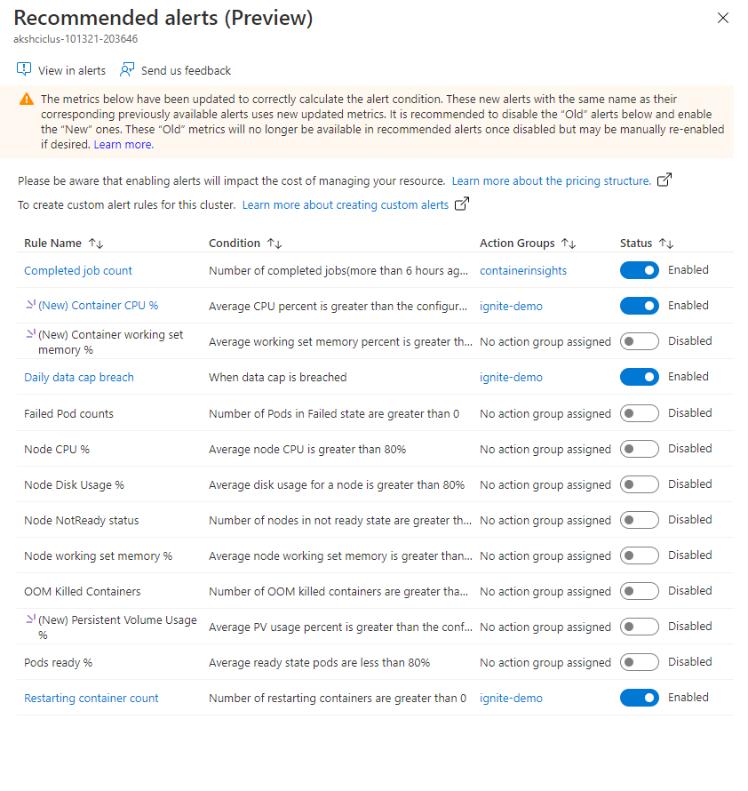

To further manage or customize this alert, you can select the link under the 'Rule Name' column to open the alert in the 'Alerts' blade.

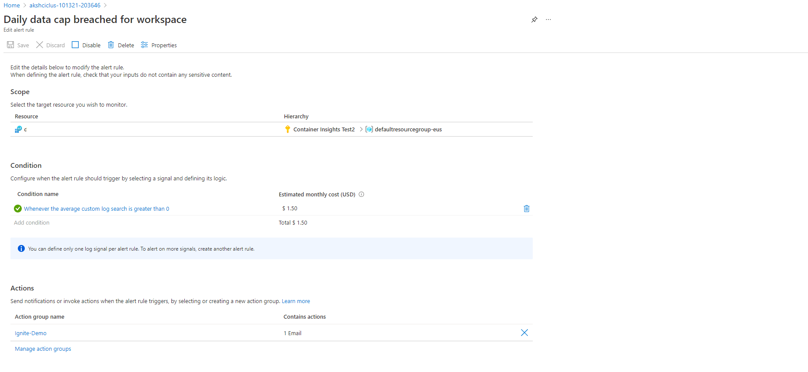

For additional information on what metrics these alerts use and other settings, check out [our documentation](https://docs.microsoft.com/azure/azure-monitor/containers/container-insights-metric-alerts).
