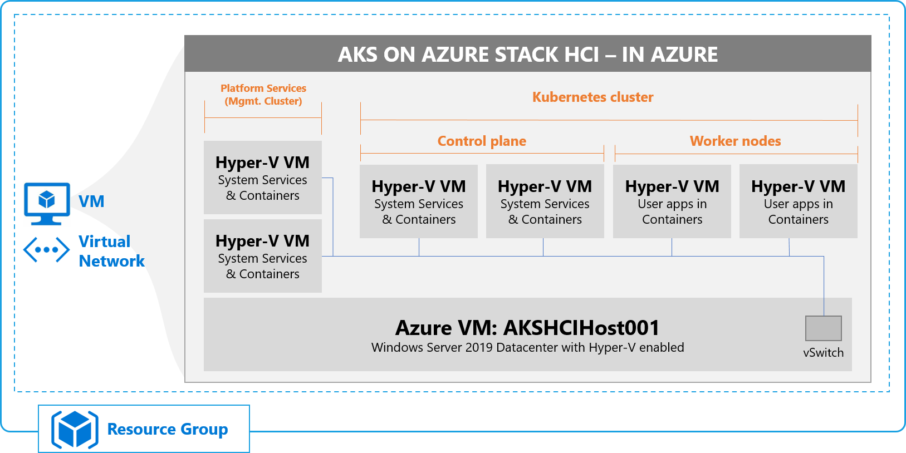
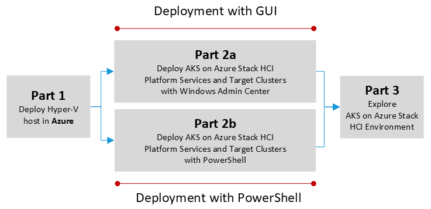

AKS on Azure Stack HCI (Preview) in Azure - Eval Guide
==============

## Welcome to the AKS on Azure Stack HCI (Preview) in Azure - Eval Guide ##

In this guide, we'll walk you deploying the [Azure Kubernetes Service (AKS) on Azure Stack HCI (currently in preview) in an Azure VM](https://docs.microsoft.com/en-us/azure-stack/aks-hci/overview "link to the What is Azure Kubernetes Service on Azure Stack HCI documentation landing page"), and set the foundation for you to explore in your own time.  You'll cover aspects such as:

* Deploying and configuring a Windows Server 2019 Azure VM to host the infrastructure
* Deployment of the AKS on Azure Stack HCI management cluster with Windows Admin Center and/or PowerShell
* Deployment of the AKS on Azure Stack HCI target/workload clusters with Windows Admin Center and/or PowerShell
* Deployment of a simple test application and exposing the app externally
* Integrating with Azure Arc
* and more...!

Version
-----------
This guide has been tested and validated with the **March 2021 release** of AKS on Azure Stack HCI.

Contents
-----------
- [Welcome to the AKS on Azure Stack HCI (Preview) in Azure - Eval Guide](#welcome-to-the-aks-on-azure-stack-hci-preview-in-azure---eval-guide)
- [Version](#version)
- [Contents](#contents)
- [What is AKS on Azure Stack HCI?](#what-is-aks-on-azure-stack-hci)
- [Why follow this guide?](#why-follow-this-guide)
- [Evaluate AKS on Azure Stack HCI using Nested Virtualization](#evaluate-aks-on-azure-stack-hci-using-nested-virtualization)
- [Deployment Overview](#deployment-overview)
- [Deployment Workflow](#deployment-workflow)
- [Get started](#get-started)
- [Product improvements](#product-improvements)
- [Raising issues](#raising-issues)
- [Contributions & Legal](#contributions--legal)

What is AKS on Azure Stack HCI?
-----------

If you've landed on this page, and you're still wondering what AKS on Azure Stack HCI is, Azure Kubernetes Service on Azure Stack HCI, **currently in public preview**, is an on-premises implementation of Azure Kubernetes Service (AKS), which automates running containerized applications at scale. Azure Kubernetes Service is now in preview on Azure Stack HCI 20H2 and Windows Server 2019 Datacenter-based clusters, making it quicker to get started hosting Linux and Windows containers in your datacenter.

If you're interested in learning more about what AKS on Azure Stack HCI is, make sure you [check out the official documentation](https://docs.microsoft.com/en-us/azure-stack/aks-hci/overview "What is Azure Kubernetes Service on Azure Stack HCI documentation"), before coming back to continue your evaluation experience. We'll refer to the docs in various places in the guide, to help you build your knowledge of AKS on Azure Stack HCI.

Why follow this guide?
-----------

This evaluation guide will walk you through standing up a sandboxed, isolated AKS on Azure Stack HCI environment using **nested virtualization** in Azure.  Whilst not designed as a production scenario, the important takeaway here is, by following this guide, you'll lay down a solid foundation on to which you can explore additional AKS on Azure Stack HCI scenarios in the future, so keep checking back for additional scenarios over time.

Evaluate AKS on Azure Stack HCI using Nested Virtualization
-----------

As with any infrastructure technology, in order to test, validate and evaluate the technology, there's typically a requirement for hardware.  If you're fortunate enough to have multiple server-class pieces of hardware going spare (ideally hardware validated for Azure Stack HCI, found on our [Azure Stack HCI Catalog](https://aka.ms/azurestackhcicatalog "Azure Stack HCI Catalog")), you can certainly perform a more real-world evaluation of AKS on Azure Stack HCI. For those that don't have spare hardware, using nested virtualization can be a great alternative for evaluation.

If you're not familiar with nested virtualization, at a high level, it allows a virtualization platform, such as Hyper-V, or VMware ESXi, to run virtual machines that, within those virtual machines, run a virtualization platform. It may be easier to think about this in an architectural view.

As you can see from the graphic, at the base layer, you have physical hardware, onto which you install a hypervisor. In this case, for our example, we're using Windows Server 2019 with the Hyper-V role enabled.  The hypervisor on the lowest level is considered L0 or the level 0 hypervisor.  In Azure, you don't have access or control over this. On that physical host, you create a virtual machine, and into that virtual machine, you deploy an OS that itself, has a hypervisor enabled.  In this example, that 1st Virtualized Layer is running a **nested** operating system with Hyper-V enabled - for instance, this could be Windows Server 2019. This would be an L1 or level 1 hypervisor. Finally, in our example, inside that OS, you could create a virtual machine to run a workload.  This could in fact also contain a hypervisor, which would be known as the L2 or level 2 hypervisor, and so the process continues, with multiple levels of nested virtualization possible.

### Important Note ###
The use of nested virtualization in this evaluation guide is aimed at providing flexibility for **evaluating AKS on Azure Stack HCI in test environment**, and it shouldn't be seen as a substitute for real-world deployments, performance and scale testing etc. With each level of nesting, comes the trade-off of performance, hence for **production** use, **AKS on Azure Stack HCI should be deployed on validated physical hardware**, of which you can find a vast array of choices on the [Azure Stack HCI 20H2 Catalog](https://aka.ms/azurestackhcicatalog "Azure Stack HCI 20H2 Catalog") or the [Windows Server Catalog](https://www.windowsservercatalog.com/results.aspx?bCatID=1283&cpID=0&avc=126&ava=0&avq=0&OR=1&PGS=25 "Windows Server Catalog") for systems running Windows Server 2019 Datacenter edition.

Deployment Overview
-----------
For those of you who don't have multiple server-class pieces of hardware running Azure Stack HCI 20H2 or Windows Server 2019, this evaluation guide will detail deploying AKS on Azure Stack HCI inside an Azure VM, using **nested virtualization**.

In this configuration, you'll take advantage of the nested virtualization support provided within certain Azure VM sizes. You'll first deploy a single Azure VM running Windows Server 2019 Datacenter. Inside this VM, you'll enable the Hyper-V and DNS roles, and download the necessary software to deploy AKS on Azure Stack HCI. You'll then deploy the AKS on Azure Stack HCI management cluster, and worker node clusters. All of this, in a single Azure VM!

### Important Note ###
The steps outlined in this evaluation guide are **specific to running inside an Azure VM**, running a single Windows Server 2019 OS, without a domain environment configured. If you plan to use these steps in an alternative environment, such as one nested/physical on-premises, or in a domain-joined environment, the steps may differ and certain procedures may not work. If that is the case, please refer to the [official documentation to deploy AKS on Azure Stack HCI](https://docs.microsoft.com/en-us/azure-stack/aks-hci/ "official documentation to deploy AKS on Azure Stack HCI").

Deployment Workflow
-----------
This guide will walk you through deploying a sandboxed AKS on Azure Stack HCI infrastructure. To accommodate different preferences, we've provided paths for those of you who prefer PowerShell, or GUI (Graphical User Interface, such as Windows Admin Center)-based deployments.

The general flow will be as follows:

**Part 1 - Deploy Windows Server 2019 Hyper-V host in Azure**: In this step, you'll create a suitable VM in Azure using PowerShell or an Azure Resource Manager template. This VM will run Windows Server 2019 Datacenter, with the full desktop experience.  On this system, you'll enable the necessary roles and features and accompanying management tools, and configure networking to enable network communication between sandbox VMs, and out to the internet.

**Part 2 - Deploy AKS on Azure Stack HCI**: In this step, you'll use **either Windows Admin Center, or PowerShell** to deploy AKS on Azure Stack HCI - this will consist of first deploying the necessary management cluster, then followed by a target cluster, for running workloads.

**Part 3 - Explore AKS on Azure Stack HCI Environment**: With your deployment completed, you're now ready to explore many of the aspects within the AKS on Azure Stack HCI. We'll also provide links to further scenarios and resources to continue your evaluation.

Get started
-----------

* [**Part 1** - Start your deployment into Azure](/eval/steps/1_AKSHCI_Azure.md "Start your deployment into Azure")
* [**Part 2a** - Deploy your AKS-HCI infrastructure with Windows Admin Center **(Choose 2a or 2b)**](/eval/steps/2a_DeployAKSHCI_WAC.md "Deploy your AKS-HCI infrastructure with Windows Admin Center")
* [**Part 2b** - Deploy your AKS-HCI infrastructure with PowerShell **(Choose 2a or 2b)**](/eval/steps/2b_DeployAKSHCI_PS.md "Deploy your AKS-HCI infrastructure with PowerShell")
* [**Part 3** - Explore the AKS on Azure Stack HCI Environment](/eval/steps/3_ExploreAKSHCI.md "Explore the AKS on Azure Stack HCI Environment")

Product improvements
-----------
If, while you work through this guide, you have an idea to make the product better, whether it's something in AKS on Azure Stack HCI, Windows Admin Center, or the Azure Arc integration and experience, let us know! We want to hear from you! [Head on over to our AKS on Azure Stack HCI GitHub page](https://github.com/Azure/aks-hci/issues "AKS on Azure Stack HCI GitHub"), where you can share your thoughts and ideas about making the technologies better.  If however, you have an issue that you'd like some help with, read on... 

Raising issues
-----------
If you notice something is wrong with the evaluation guide, such as a step isn't working, or something just doesn't make sense - help us to make this guide better!  Raise an issue in GitHub, and we'll be sure to fix this as quickly as possible!

If however, you're having a problem with AKS on Azure Stack HCI **outside** of this evaluation guide, make sure you post to [our GitHub Issues page](https://github.com/Azure/aks-hci/issues "GitHub Issues"), where Microsoft experts and valuable members of the community will do their best to help you.

Contributions & Legal
-----------

### Contributing ###
This project welcomes contributions and suggestions.  Most contributions require you to agree to a Contributor License Agreement (CLA) declaring that you have the right to, and actually do, grant us the rights to use your contribution. For details, visit https://cla.opensource.microsoft.com.

When you submit a pull request, a CLA bot will automatically determine whether you need to provide a CLA and decorate the PR appropriately (e.g., status check, comment). Simply follow the instructions provided by the bot. You will only need to do this once across all repos using our CLA.

This project has adopted the [Microsoft Open Source Code of Conduct](https://opensource.microsoft.com/codeofconduct/).
For more information see the [Code of Conduct FAQ](https://opensource.microsoft.com/codeofconduct/faq/) or
contact [opencode@microsoft.com](mailto:opencode@microsoft.com) with any additional questions or comments.

### Legal Notices ###

Microsoft and any contributors grant you a license to the Microsoft documentation and other content in this repository under the [Creative Commons Attribution 4.0 International Public License](https://creativecommons.org/licenses/by/4.0/legalcode), see the [LICENSE](LICENSE) file, and grant you a license to any code in the repository under the [MIT License](https://opensource.org/licenses/MIT), see the [LICENSE-CODE](LICENSE-CODE) file.

Microsoft, Windows, Microsoft Azure and/or other Microsoft products and services referenced in the documentation may be either trademarks or registered trademarks of Microsoft in the United States and/or other countries. The licenses for this project do not grant you rights to use any Microsoft names, logos, or trademarks. Microsoft's general trademark guidelines can be found at http://go.microsoft.com/fwlink/?LinkID=254653.

Privacy information can be found at https://privacy.microsoft.com/en-us/

Microsoft and any contributors reserve all other rights, whether under their respective copyrights, patents, or trademarks, whether by implication, estoppel or otherwise.
